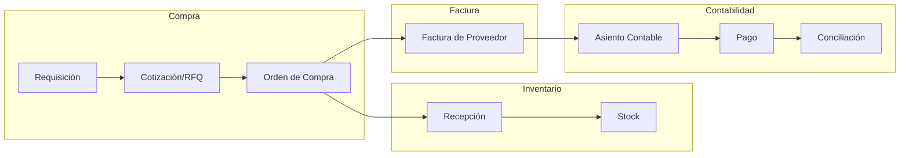
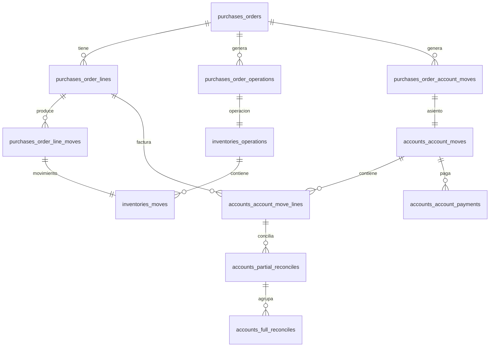

# Flujo Funcional: Compra → Inventario → Factura → Contabilidad



---

## 1. Módulo de Compras (`purchases`)

### Modelo Central: `Order` (`purchases_orders`)

La orden de compra es el núcleo del flujo. Pasa por estos estados:

```
draft → sent → to_approve → purchase → done
                         ↘ canceled
```

| Estado | Descripción |
|--------|-------------|
| `draft` | Cotización/RFQ inicial. Borrador editable |
| `sent` | RFQ enviada al proveedor vía email |
| `to_approve` | Pendiente de aprobación (si supera monto configurado) |
| `purchase` | OC confirmada, desbloqueada (editable) |
| `done` | OC confirmada, bloqueada (inmutable) |
| `canceled` | Cancelada. Reversible a `draft` |

### Líneas de Compra: `OrderLine` (`purchases_order_lines`)

Cada línea contiene: producto, cantidad, precio unitario, descuento, impuestos, y estados de recepción/facturación.

### Servicio Principal: `PurchaseOrder`

Métodos clave:

| Método | Función |
|--------|---------|
| `sendRFQ()` | Envía RFQ al proveedor, transición a `sent` |
| `confirmPurchaseOrder()` | Confirma la OC. Evalúa si requiere aprobación |
| `approveOrder()` | Aprueba la OC. Crea operación de inventario |
| `cancelPurchaseOrder()` | Cancela la OC |
| `createPurchaseOrderBill()` | Crea la factura de proveedor |
| `createInventoryOperation()` | Crea la recepción de inventario |
| `createAccountMove()` | Crea el asiento contable |

### Disparo de Flujo

`confirmPurchaseOrder()`:
1. Si `enable_order_approval` está activo y el monto supera `order_validation_amount` → `to_approve`
2. Si no requiere aprobación → `approveOrder()`:
   - Estado → `purchase` o `done` (si locked)
   - Llama a `createInventoryOperation()` → crea Recepción + movimientos de stock
   - Si el módulo invoices está activo, prepara facturación

---

## 2. Módulo de Inventario (`inventories`)

### Modelo Central: `Operation` (`inventories_operations`)

Representa una operación de inventario. Subtipos: Recepción, Entrega, Transferencia Interna, Dropship, Scrap.

```
draft → confirmed → waiting → assigned → done
                                       ↘ canceled
```

### Modelo: `Move` (`inventories_moves`)

Movimiento de stock individual dentro de una operación.

```
draft → confirmed → waiting → partially_assigned → assigned → done
                                                  ↘ canceled
```

| Estado | Descripción |
|--------|-------------|
| `draft` | Inicial |
| `confirmed` | Confirmado en sistema |
| `waiting` | Esperando otro movimiento (ej: esperando recepción) |
| `partially_assigned` | Stock parcialmente reservado |
| `assigned` | Stock completamente reservado |
| `done` | Completado. Las cantidades se actualizan |
| `canceled` | Cancelado |

### Recepción (Purchase Receipt)

Cuando se confirma una OC (`approveOrder()`):

1. `createInventoryOperation()` busca un `OperationType` de tipo `INCOMING` para la bodega
2. Crea un `Receipt` (operación) si no existe una en estado no-finalizado
3. Por cada línea de OC con `product.type === 'goods'`:
   - Calcula cantidad a recibir
   - Crea `Move` con origen = proveedor, destino = ubicación de stock
   - Vincula el move a la línea de OC (`purchase_order_line_id`)
4. `InventoryFacade::confirmMoves()` → mueve moves de `draft` → `confirmed`
5. `InventoryFacade::assignMoves()` → reserva stock si está disponible
6. Usuario valida la recepción → `validateTransfer()` → moves → `done`
7. Se actualizan las cantidades (`ProductQuantity`) por producto/ubicación/lote

### Tablas Puente

| Tabla | Relación |
|-------|----------|
| `purchases_order_operations` | OC → Operaciones de inventario |
| `purchases_order_line_moves` | Línea de OC → Movimiento de inventario |

---

## 3. Módulo de Facturas (`accounts`)

### Modelo Central: `Move` (`accounts_account_moves`)

Tabla única para TODOS los documentos contables (facturas, notas de crédito, asientos). Diferenciados por `move_type`:

| `move_type` | Descripción |
|-------------|-------------|
| `out_invoice` | Factura de cliente (AR) |
| `out_refund` | Nota de crédito a cliente |
| `in_invoice` | Factura de proveedor (AP) — **usada en compras** |
| `in_refund` | Nota de crédito de proveedor |
| `entry` | Asiento contable genérico |
| `out_receipt` | Recibo de cliente |
| `in_receipt` | Recibo de proveedor |

### Estados del Move

```
draft → posted
  ↘ cancel
```

| Estado | Descripción |
|--------|-------------|
| `draft` | Editable. Antes de contabilizar |
| `posted` | Contabilizado. Generalmente inmutable |
| `cancel` | Anulado/Void |

### Factura de Proveedor (Bill)

Se crea desde la OC mediante `createPurchaseOrderBill()`:

1. `createAccountMove()` con `move_type = IN_INVOICE`
2. Establece `invoice_origin = [nombre de la OC]`
3. Vincula mediante `purchases_order_account_moves` (tabla pivote)
4. Por cada línea de OC: crea `MoveLine` con:
   - Producto, cantidad (`qty_to_invoice`), precio, descuento, impuestos
5. `AccountFacade::computeAccountMove()` → calcula montos totales e impuestos

### Líneas de Asiento: `MoveLine` (`accounts_account_move_lines`)

Cada línea tiene: cuenta contable, producto, cantidad, débito, crédito, impuestos, y referencia a línea de OC.

### Tablas Puente

| Tabla | Relación |
|-------|----------|
| `purchases_order_account_moves` | OC → Facturas/Asientos contables |

---

## 4. Módulo de Contabilidad (`accounting`)

### Reportes

| Reporte | Descripción |
|---------|-------------|
| General Ledger | Mayor contable por cuenta |
| Trial Balance | Balance de comprobación |
| Profit & Loss | Estado de resultados |
| Balance Sheet | Balance general |
| Aged Receivable | Antigüedad de saldos por cobrar |
| Aged Payable | Antigüedad de saldos por pagar |

### Pago: `Payment` (`accounts_account_payments`)

1. Se registra contra la factura (bill) mediante el registro de pagos
2. El estado de pago se refleja en `payment_state` del Move
3. Soporta múltiples medios de pago

### Conciliación

| Modelo | Descripción |
|--------|-------------|
| `PartialReconcile` | Concilia pares de débito/crédito individuales |
| `FullReconcile` | Agrupa conciliaciones parciales en una conciliación completa |

Flujo:
1. Líneas de débito y crédito se emparejan vía `PartialReconcile`
2. Múltiples `PartialReconcile` se agrupan en un `FullReconcile`
3. Una vez conciliado completamente, el move se marca como `posted` y `reconciled`

---

## 5. Flujo Completo (Paso a Paso)

```
1. USUARIO crea Requisición de Compra
   └─ Estado: draft → ongoing

2. USUARIO crea Cotización (RFQ) desde requisición o directo
   └─ purchasers_orders.state = draft

3. USUARIO envía RFQ al proveedor
   └─ sendRFQ() → state = sent

4. PROVEEDOR responde → USUARIO confirma OC
   └─ confirmPurchaseOrder()
       ├─ ¿Requiere aprobación? → state = to_approve (espera)
       └─ No requiere → approveOrder()
           ├─ state = purchase (o done)
           ├─ Crea Recepción de inventario
           │   └─ inventories_operations.state = draft
           └─ Crea movimientos de stock
               └─ inventories_moves.state = draft

5. BODEGA recibe productos → valida recepción
   └─ validateTransfer()
       ├─ inventories_moves.state = done
       ├─ inventories_operations.state = done
       └─ Se actualizan cantidades en stock (ProductQuantity)

6. USUARIO crea Factura de Proveedor desde la OC
   └─ createPurchaseOrderBill()
       ├─ accounts_account_moves.move_type = in_invoice
       └─ accounts_account_moves.state = draft

7. USUARIO contabiliza la factura
   └─ accounts_account_moves.state = posted
       └─ Se crean asientos contables (MoveLines)

8. USUARIO registra Pago al proveedor
   └─ accounts_account_payments
       └─ payment_state actualizado en el Move

9. SISTEMA concilia pago con factura
   └─ PartialReconcile → FullReconcile
       └─ Cuenta queda saldada
```

---

## 6. Diagrama de Tablas y Relaciones



---

## 7. Enumeraciones Clave

### `OrderState` (Compras)
| Constante | Valor DB | Siguiente |
|-----------|----------|-----------|
| `DRAFT` | `draft` | `sent` |
| `SENT` | `sent` | `to_approve` o `purchase` |
| `TO_APPROVE` | `to_approve` | `purchase` |
| `PURCHASE` | `purchase` | `done` |
| `DONE` | `done` | — |
| `CANCELED` | `canceled` | `draft` |

### `MoveState` (Inventario)
| Constante | Valor DB |
|-----------|----------|
| `DRAFT` | `draft` |
| `CONFIRMED` | `confirmed` |
| `WAITING` | `waiting` |
| `PARTIALLY_ASSIGNED` | `partially_assigned` |
| `ASSIGNED` | `assigned` |
| `DONE` | `done` |
| `CANCELED` | `canceled` |

### `MoveState` (Contabilidad)
| Constante | Valor DB |
|-----------|----------|
| `DRAFT` | `draft` |
| `POSTED` | `posted` |
| `CANCEL` | `cancel` |

### `MoveType` (Contabilidad)
| Constante | Valor DB | Uso |
|-----------|----------|-----|
| `ENTRY` | `entry` | Asiento genérico |
| `OUT_INVOICE` | `out_invoice` | Factura cliente |
| `OUT_REFUND` | `out_refund` | NC cliente |
| `IN_INVOICE` | `in_invoice` | Factura proveedor |
| `IN_REFUND` | `in_refund` | NC proveedor |
| `OUT_RECEIPT` | `out_receipt` | Recibo cliente |
| `IN_RECEIPT` | `in_receipt` | Recibo proveedor |

---

## 8. Ubicación de Archivos Clave

| Componente | Archivo |
|------------|---------|
| Servicio de OC | `plugins/webkul/purchases/src/PurchaseOrder.php` |
| Modelo Order | `plugins/webkul/purchases/src/Models/Order.php` |
| Modelo OrderLine | `plugins/webkul/purchases/src/Models/OrderLine.php` |
| Enum OrderState | `plugins/webkul/purchases/src/Enums/OrderState.php` |
| Servicio Inventario | `plugins/webkul/inventories/src/InventoryManager.php` |
| Modelo Move (inv) | `plugins/webkul/inventories/src/Models/Move.php` |
| Modelo Operation | `plugins/webkul/inventories/src/Models/Operation.php` |
| Modelo Receipt | `plugins/webkul/inventories/src/Models/Receipt.php` |
| Modelo Move (acct) | `plugins/webkul/accounts/src/Models/Move.php` |
| Modelo MoveLine | `plugins/webkul/accounts/src/Models/MoveLine.php` |
| Modelo Payment | `plugins/webkul/accounts/src/Models/Payment.php` |
| Enum MoveType | `plugins/webkul/accounts/src/Enums/MoveType.php` |
| Filament OC | `plugins/webkul/purchases/src/Filament/Admin/Clusters/Orders/Resources/` |
| Filament Inventario | `plugins/webkul/inventories/src/Filament/Clusters/Operations/Resources/` |
| Filament Facturas | `plugins/webkul/accounts/src/Filament/Resources/` |
