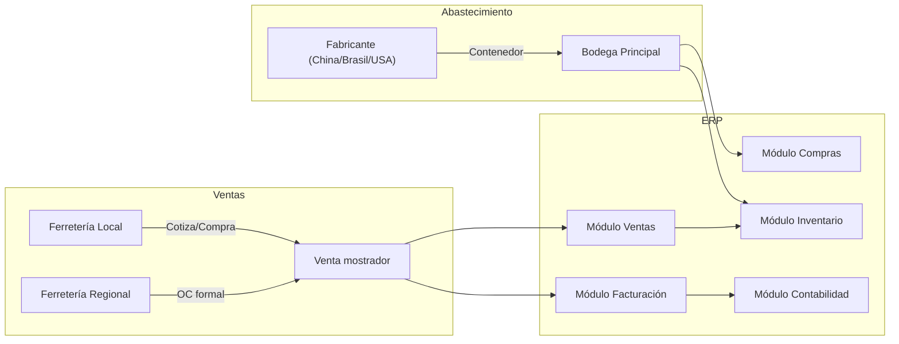
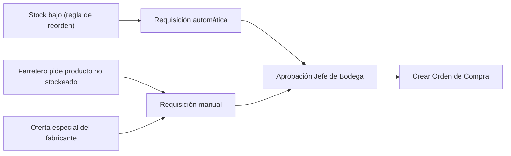
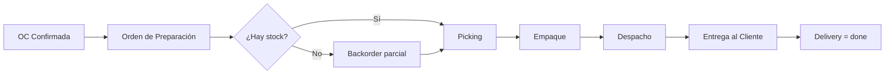
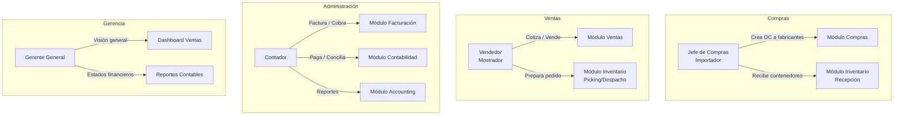

# Flujo de Uso: Mayorista de Herramientas para Ferreterías

## Perfil de la Empresa

Importadora y distribuidora mayorista de herramientas para ferreterías. Compra contenedores completos de fabricantes (China, Brasil, USA) y vende por mayoreo a ferreterías locales y regionales.

**Catálogo típico:** Martillos, destornilladores, taladros, sierras, llaves, tuercas, tornillos, equipos de seguridad, pinturas, etc.

---



---

## 1. Configuración Inicial

### 1.1 Catálogo de Productos

Cada herramienta se configura como **Producto** con:

| Campo | Ejemplo |
|-------|---------|
| Nombre | Martillo de uña 16oz mango fibra |
| SKU/Código | HAM-16-FIB |
| Tipo | Producto almacenable (storable) |
| Categoría | Martillos |
| Precio de venta | $4.500 CLP |
| Costo | $2.800 CLP |
| Unidad de medida | Unidad (U) |
| Impuesto | IVA 19% |
| Presentación | Caja x 12 unidades |

**Configuración de variantes:**
- Martillo 12oz → SKU: HAM-12-FIB
- Martillo 16oz → SKU: HAM-16-FIB
- Martillo 20oz → SKU: HAM-20-FIB

### 1.2 Bodegas y Ubicaciones

| Bodega | Uso |
|--------|-----|
| Bodega Principal | Almacenamiento general de toda la mercadería |
| Recepción | Zona de control de calidad al recibir contenedores |
| Picking | Zona de preparación de pedidos para despacho |
| Exhibición/Ventas | Productos disponibles para venta directa a ferreteros |

### 1.3 Socios Comerciales

**Proveedores (fabricantes):**
- ToolMaster China → Importación trimestral
- IndusSteel Brasil → Importación mensual
- USA Supply Corp → Importación semestral

**Clientes (ferreterías):**
- Ferretería El Constructor (Santiago)
- Ferretería La Casa del Maestro (Valparaíso)
- Ferretería El Tornillo Feliz (Concepción)
- Ferretería Doña Juanita (Tienda local)

### 1.4 Impuestos y Cuentas Contables

| Configuración | Valor |
|---------------|-------|
| Impuesto por defecto | IVA 19% incluido en precio |
| Cuenta de costo de venta | 5-1-01 Costo de Mercaderías |
| Cuenta de inventario | 1-1-03 Mercaderías |
| Cuenta de ingreso por ventas | 4-1-01 Ingresos por Ventas |
| Cuenta de IVA débito | 2-1-09 IVA Débito Fiscal |
| Cuenta de IVA crédito | 1-1-11 IVA Crédito Fiscal |
| Cuenta proveedores | 2-1-01 Proveedores |
| Cuenta clientes | 1-1-05 Clientes |
| Diario de compras | DIARIO-COMP |
| Diario de ventas | DIARIO-VENT |

---

## 2. Flujo de Abastecimiento (Compras)

### 2.1 Detección de Necesidad



**Escenario práctico:** Martillo 16oz tiene stock mínimo de 50 unidades. Cuando baja a 50, el sistema genera automáticamente una requisición para reponer 500 unidades.

### 2.2 Orden de Compra a Fabricante

1. Jefe de bodega crea **Cotización (RFQ)** al proveedor ToolMaster China:
   - 500 Martillos 16oz a $2.800 c/u → $1.400.000
   - 300 Juegos de destornilladores 12pz a $3.200 c/u → $960.000
   - Total cotización: $2.360.000 + IVA

2. Envía RFQ por email al fabricante

3. Fabricante confirma → Jefe de compras **confirma la OC**

4. **¿Requiere aprobación?** Si supera $5.000.000 → va a `to_approve`, espera aprobación del gerente

### 2.3 Llegada del Contenedor

1. Llega contenedor al puerto → se registra la **Recepción** en bodega
2. Se validan cantidades contra packing list
3. Se detectan 5 martillos dañados → se crea **devolución**
4. Se validan las cantidades correctas → el sistema actualiza el stock
5. La OC queda con estado `done`, `receipt_status = full`

**Caso real:** Llegan 300 juegos de destornilladores pero vienen 280. Se registran 280 recibidos y 20 en falta. La OC queda con `receipt_status = partial`.

### 2.4 Factura del Proveedor

1. Contabilidad recibe la factura electrónica del fabricante
2. Contador **crea la Factura de Proveedor (Bill)** desde la OC
3. Verifica montos vs OC y recepción real
4. **Contabiliza** la factura → se generan los asientos contables:
   - Débito: Inventario (1-1-03) $2.360.000
   - Débito: IVA Crédito (1-1-11) $448.400
   - Crédito: Proveedores (2-1-01) $2.808.400

---

## 3. Flujo de Ventas (a Ferreterías)

### 3.1 Cotización

**Escenario:** Ferretería El Constructor solicita cotización para:

| Producto | Cantidad | Precio Unitario | Total |
|----------|----------|----------------|-------|
| Martillo 16oz | 24 | $4.500 | $108.000 |
| Juego destornillador 12pz | 12 | $6.500 | $78.000 |
| Taladro percutor 750W | 6 | $35.000 | $210.000 |
| Caja tornillos 4" x 100 | 10 | $3.200 | $32.000 |
| **Total** | | | **$428.000** |
| **IVA 19%** | | | **$81.320** |
| **Total con IVA** | | | **$509.320** |

Proceso:
1. Vendedor crea **Cotización** en el sistema (`state = draft`)
2. Selecciona ferretería como cliente (carga automática de datos, dirección, condiciones de pago)
3. Agrega productos con precios de lista (puede aplicar descuento por volumen)
4. Sistema calcula subtotal, impuestos y total
5. Vendedor envía cotización por email → `state = sent`

### 3.2 Confirmación del Pedido

1. Ferretería confirma la compra
2. Vendedor **confirma la OC de venta** (`confirmSaleOrder()`)
3. Estado → `sale`, `invoice_status = to_invoice`
4. Sistema aplica reglas de inventario:
   - **Reserva** los productos en bodega (si hay stock)
   - Si stock insuficiente → `delivery_status = pending`, queda pendiente de fabricación
5. Se genera **orden de preparación** (picking) en bodega

### 3.3 Despacho (Entrega)



Proceso en bodega:
1. Jefe de bodega abre la **Entrega (Delivery Order)**
2. Sistema muestra productos reservados y ubicación en racks
3. Preparador recoge productos del picking
4. Se empaqueta y rotula con datos del cliente
5. Se confirma el despacho → `validateTransfer()` → movimientos de stock se completan
6. Stock se descuenta de la bodega

**Escenario real:** Ferretería pidió 6 taladros pero solo hay 4 en stock. El sistema crea:
- Una entrega por 4 unidades (parcial) → se despacha inmediatamente
- Un backorder por 2 unidades → queda pendiente hasta nuevo abastecimiento

### 3.4 Facturación al Cliente

1. Al final del día (o al despachar), vendedor/facturador crea la **Factura (Invoice)**
2. Política de facturación: basada en **cantidad entregada** (o pedida según configuración)
3. Sistema genera asiento de **Venta**:
   - Débito: Cliente (1-1-05) $509.320
   - Crédito: Ingresos por Ventas (4-1-01) $428.000
   - Crédito: IVA Débito (2-1-09) $81.320
4. Y asiento de **Costo de Venta**:
   - Débito: Costo de Mercaderías (5-1-01) $280.000
   - Crédito: Inventario (1-1-03) $280.000

### 3.5 Estados de Entrega y Factura

| Indicador | Descripción |
|-----------|-------------|
| `delivery_status = no` | Productos digitales/servicios, no requieren entrega |
| `delivery_status = pending` | Pendiente de despachar |
| `delivery_status = partial` | Parcialmente despachado (backorder) |
| `delivery_status = full` | Completamente despachado |
| `invoice_status = no` | No facturable aún |
| `invoice_status = to_invoice` | Pendiente de facturar |
| `invoice_status = invoiced` | Facturado completamente |
| `invoice_status = up_selling` | Facturado más de lo entregado |

---

## 4. Ciclo de Pago y Contabilidad

### 4.1 Pago a Proveedores (Fabricante)

1. Llega vencimiento de la factura del fabricante
2. Contador registra el **pago** contra la factura del proveedor
3. Asiento:
   - Débito: Proveedores (2-1-01) $2.808.400
   - Crédito: Banco (1-1-06) $2.808.400
4. Sistema concilia el pago con la factura → `FullReconcile`

### 4.2 Cobro a Clientes (Ferreterías)

1. Ferretería tiene plazo de 30 días (condición de pago configurada)
2. Se emite Factura Electrónica (SII en Chile) desde el sistema
3. Al recibir el pago, contador **registra el cobro**:
   - Débito: Banco (1-1-06) $509.320
   - Crédito: Cliente (1-1-05) $509.320
4. Sistema concilia automáticamente

### 4.3 Reportes Clave

| Reporte | Uso diario | Frecuencia |
|---------|------------|------------|
| **General Ledger** | Revisión de cuentas específicas | Diario |
| **Trial Balance** | Cuadre de saldos | Mensual |
| **Aged Payable** | Control de deudas con fabricantes | Semanal |
| **Aged Receivable** | Control de cobranza a ferreterías | Diario |
| **Profit & Loss** | Margen por línea de producto | Mensual |
| **Balance Sheet** | Valuación de inventario | Mensual |

---

## 5. Escenarios del Mundo Real

### 5.1 Venta de Mostrador (Ferretero que llega a comprar)

1. Ferretero llega a la bodega/exhibición
2. Vendedor crea cotización rápida, selecciona productos en el momento
3. Si hay stock disponible en ubicación "Exhibición/Ventas" → confirma al instante
4. Se genera factura al momento, se entrega la mercadería
5. Pago puede ser: efectivo, transferencia, o crédito (si tiene línea aprobada)
6. Entrega directa → `delivery_status = full` inmediato

### 5.2 Nota de Crédito (Devolución)

1. Ferretería devuelve 2 taladros por defecto de fábrica
2. Vendedor crea **Nota de Crédito** (`move_type = out_refund`)
3. Se genera NC electrónica
4. Sistema revierte el asiento contable original
5. Si ya estaba pagado → se genera devolución del dinero o nota a favor

### 5.3 Oferta por Volumen (Descuento)

1. Fabricante ofrece 10% descuento si compran 1000+ martillos
2. Jefe de compras crea OC con 1000 martillos a precio rebajado ($2.520 c/u)
3. Llega el contenedor, se reciben 1000 martillos
4. Ferretería El Constructor quiere 200 martillos → se le ofrece descuento por volumen (5%)
5. Vendedor aplica descuento del 5% en la línea de la cotización

### 5.4 Productos Agotados / Backorder

1. Ferretero pide 50 cajas de tornillos 4"
2. Solo hay 20 en stock
3. Sistema permite confirmar igual la OC
4. Se entregan 20 → `delivery_status = partial`
5. Quedan 30 en backorder → aparecen en reporte "Pendientes de Despachar"
6. Cuando llega nuevo stock del fabricante → se asigna automáticamente al backorder
7. Se completa el despacho → `delivery_status = full`

---

## 6. Mapa de Módulos a Usuarios



---

## 7. Resumen de Ciclo Completo

```
┌─────────────────────────────────────────────────────────────────┐
│                  CICLO COMPRA → VENTA → COBRO                    │
├─────────────────────────────────────────────────────────────────┤
│                                                                   │
│  1. COMPRAR A FABRICANTE                                         │
│     RFQ → OC → Recepción → Factura Proveedor → Pago              │
│     └──────── Módulo Compras ────────┘   └── Contabilidad ──┘    │
│                                                                   │
│  2. ALMACENAR                                                      │
│     Recepción → Stock → Picking                                   │
│     └────────── Módulo Inventario ───────────┘                    │
│                                                                   │
│  3. VENDER A FERRETERÍA                                           │
│     Cotización → OC Venta → Despacho → Factura → Cobro           │
│     └── Módulo Ventas ──┘   └ Inv ─┘ └─── Contabilidad ────┘    │
│                                                                   │
│  4. CONTABILIZAR                                                  │
│     Asientos automáticos → Conciliación → Reportes                │
│     └─────────────── Módulo Contabilidad ─────────────────┘       │
│                                                                   │
└─────────────────────────────────────────────────────────────────┘
```

---

## 8. Tabla de Rutas y Acciones Rápidas

| Proceso | Módulo | Acción en el Sistema |
|---------|--------|----------------------|
| Comprar a fabricante | Compras → Órdenes | Crear Cotización → Confirmar |
| Recibir mercadería | Inventario → Recepciones | Validar Recepción |
| Factura proveedor | Facturación → Facturas Proveedor | Crear desde OC → Contabilizar |
| Pagar a proveedor | Contabilidad → Pagos | Registrar Pago |
| Cotizar a ferretero | Ventas → Cotizaciones | Crear Cotización → Enviar Email |
| Confirmar venta | Ventas → Cotizaciones | Confirmar → (reserva stock) |
| Despachar pedido | Inventario → Entregas | Validar Transferencia |
| Facturar a ferretero | Ventas → Facturación | Crear Factura desde OC |
| Cobrar a ferretero | Contabilidad → Pagos | Registrar Cobro |
| Ver rentabilidad | Accounting → Reportes | P&L por producto |
| Controlar cartera | Accounting → Reportes | Aged Receivable |
